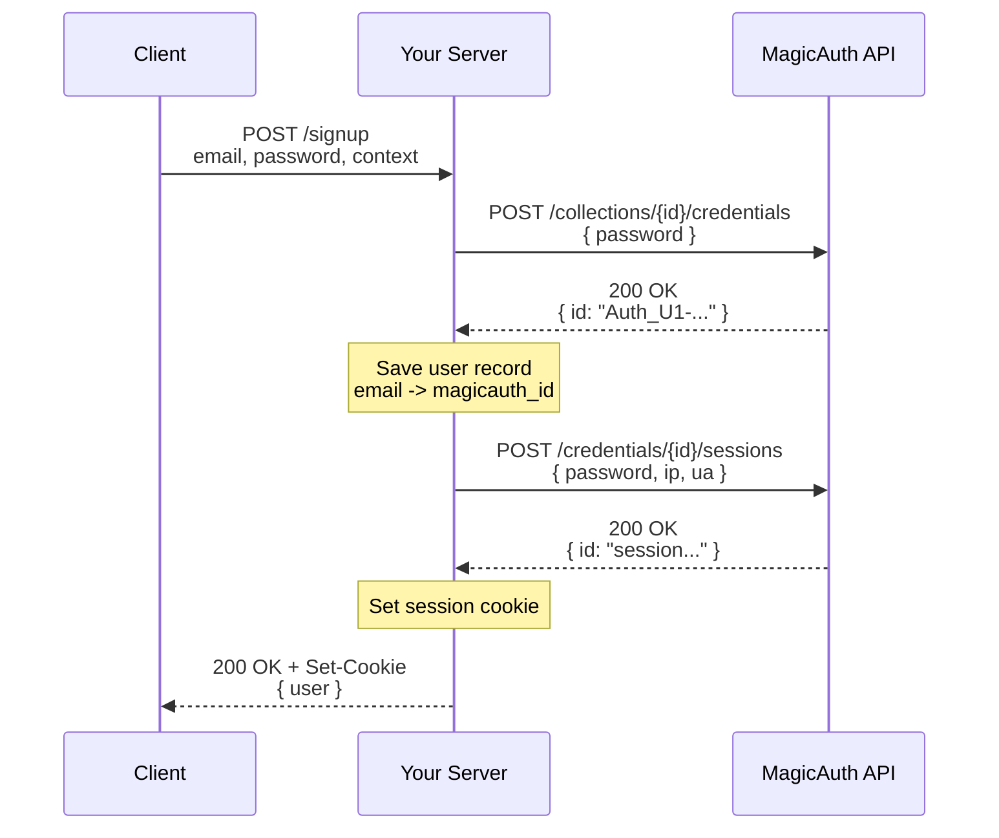
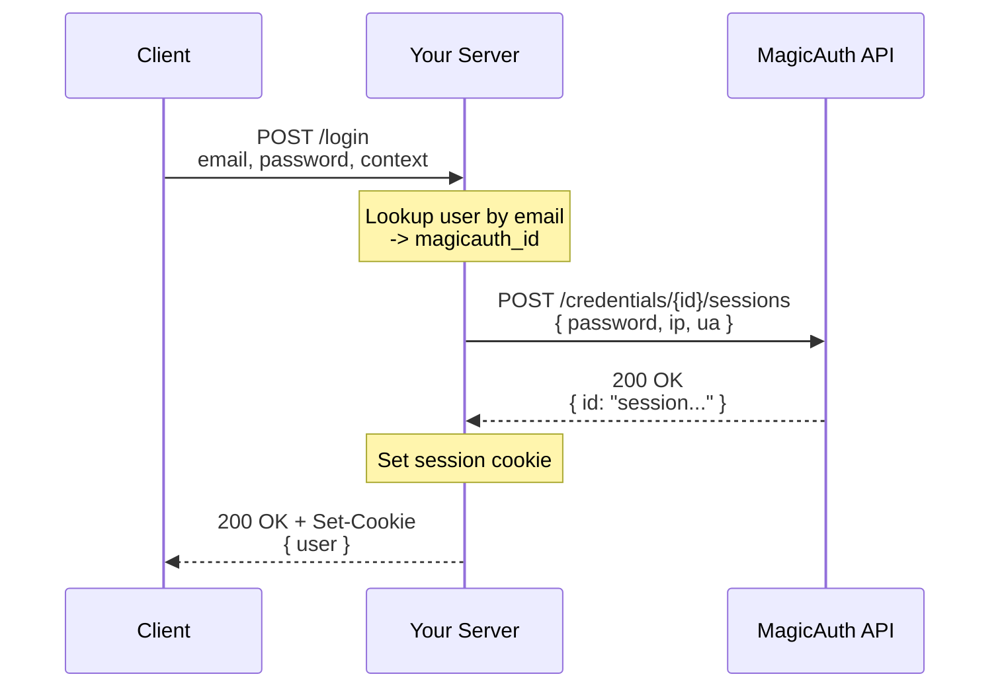
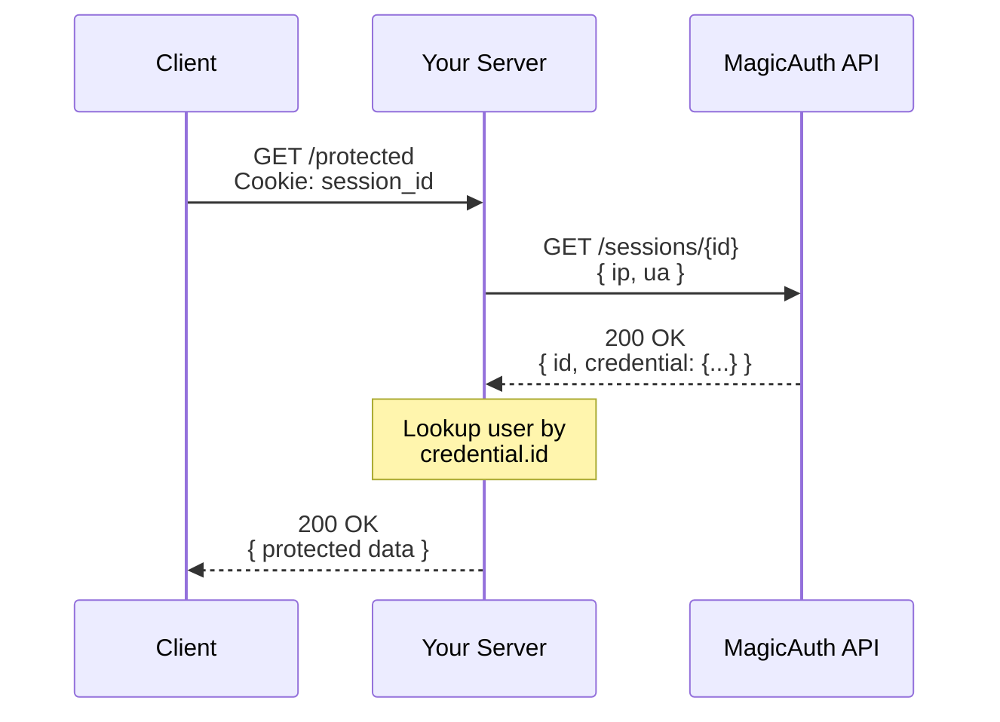
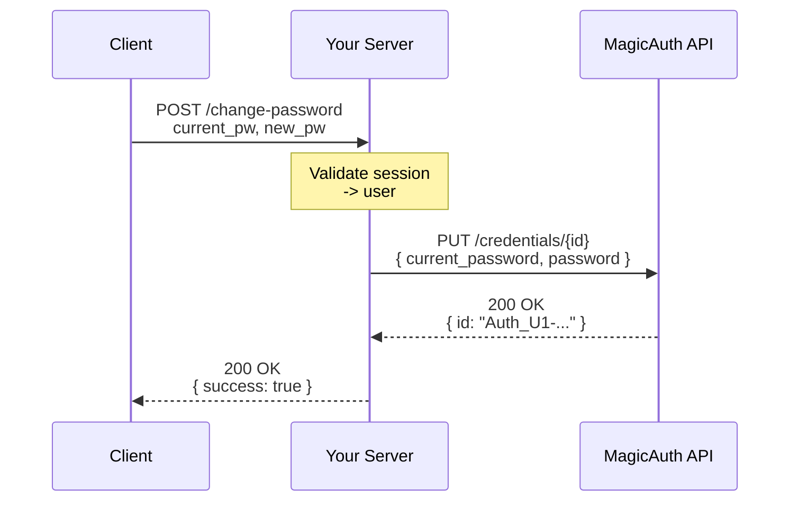
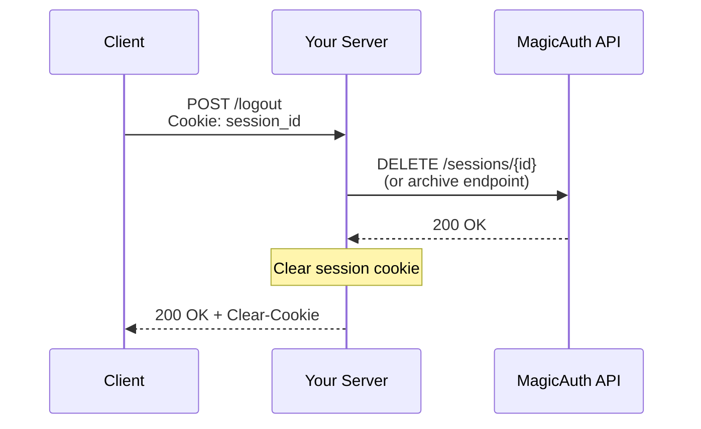

[← Back to README](./README.md)

# MagicAuth Authentication Flow

This document describes the complete authentication flows supported by the MagicAuth SDK. These flows must be preserved during refactoring.

---

## Overview

MagicAuth provides a passwordless authentication system where credentials are managed by the MagicAuth service. Your application stores only the MagicAuth credential ID (not passwords) and uses sessions for authentication.

**Key Concepts:**
- **Credential**: A MagicAuth-managed authentication credential (has a password, stored remotely)
- **Session**: A time-limited authentication token with IP/User Agent binding
- **Collection**: A namespace for organizing credentials in the MagicAuth service
- **Context**: IP address and User Agent used for session security validation

---

## Flow 1: Sign Up (User Registration)

Creates a new user in your system with MagicAuth authentication.

### Steps



### Implementation

```javascript
import { Collection } from '@whi/magicauth-sdk';

const magicauth = new Collection(collection_id, access_key);

// 1. Create MagicAuth credential
const magicuser = await magicauth.user(password);
// Returns: { id: "Auth_U1-..." }

// 2. Save user in your database
const user = {
  email: email,
  magicauth_id: magicuser.id
};
await database("users").insert(user);

// 3. Create session
const session = await magicauth.session(
  magicuser.id,
  password,
  ip_address,
  user_agent
);
// Returns: { id: "base64_session_id" }

// 4. Set session cookie
response.cookie('session_id', session.id, {
  httpOnly: true,
  secure: true,
  sameSite: 'strict'
});

// 5. Return user to client
return user;
```

### Data Storage

**Your Database:**
```
users table:
- id (primary key)
- email (unique)
- magicauth_id (string, format: "Auth_U1-...")
- ... other user fields
```

**MagicAuth Service:**
- Stores the credential (password hash)
- Stores active sessions

---

## Flow 2: Sign In (User Login)

Authenticates an existing user and creates a new session.

### Steps



### Implementation

```javascript
import { Collection } from '@whi/magicauth-sdk';

const magicauth = new Collection(collection_id, access_key);

// 1. Look up user in your database
const users = await database("users")
  .where("email", email);

if (users.length === 0) {
  throw new Error("Invalid credentials");
}

const user = users[0];

// 2. Create session with MagicAuth
const session = await magicauth.session(
  user.magicauth_id,
  password,
  ip_address,
  user_agent
);
// Returns: { id: "base64_session_id" }
// Throws error if password is wrong

// 3. Set session cookie
response.cookie('session_id', session.id, {
  httpOnly: true,
  secure: true,
  sameSite: 'strict'
});

// 4. Return user to client
return user;
```

### Error Scenarios

- **User not found**: Email doesn't exist in your database
- **Invalid password**: MagicAuth session creation fails (wrong password)
- **Network error**: Cannot reach MagicAuth service

---

## Flow 3: Session Validation (Authenticate Request)

Validates a session on each protected request.

### Steps



### Implementation

```javascript
import { Collection } from '@whi/magicauth-sdk';

const magicauth = new Collection(collection_id, access_key);

// 1. Get session ID from cookie
const session_id = request.cookies.session_id;

if (!session_id) {
  throw new Error("Not authenticated");
}

// 2. Validate session with MagicAuth
const magicsession = await magicauth.validate(
  session_id,
  ip_address,
  user_agent
);
// Returns: { id: "session...", credential: { id: "Auth_U1-..." } }
// Throws error if session invalid/expired

// 3. Look up user in your database
const users = await database("users")
  .where("magicauth_id", magicsession.credential.id);

if (users.length === 0) {
  // Session valid but user doesn't exist (shouldn't happen)
  throw new Error("User not found");
}

const user = users[0];

// 4. User is authenticated, continue with request
return processProtectedRequest(user);
```

### Error Scenarios

- **No session cookie**: User not logged in
- **Session expired**: MagicAuth validation fails (401/403)
- **IP mismatch**: Client IP changed (session invalid)
- **User Agent mismatch**: Client UA changed (session invalid)
- **Session not found**: Invalid session ID or already invalidated

### Session Expiration Handling

When validation fails due to expiration:
```javascript
try {
  const session = await magicauth.validate(session_id, ip, ua);
  // ... proceed
} catch (error) {
  // Clear cookie and redirect to login
  response.clearCookie('session_id');
  response.redirect('/login');
}
```

---

## Flow 4: Password Update

Updates a user's password in MagicAuth.

### Steps



### Implementation

```javascript
import { Collection } from '@whi/magicauth-sdk';

const magicauth = new Collection(collection_id, access_key);

// 1. Validate current session (get authenticated user)
const user = await validateSession(request);

// 2. Update password in MagicAuth
const updatedCredential = await magicauth.update_password(
  user.magicauth_id,
  current_password,
  new_password
);
// Returns: { id: "Auth_U1-..." }
// Throws error if current password is wrong

// 3. Optionally invalidate all other sessions
// (This would require additional API support or tracking)

// 4. Return success
return { success: true };
```

### Error Scenarios

- **Wrong current password**: MagicAuth rejects the update
- **Weak new password**: May be rejected by MagicAuth (if validation enabled)
- **User not authenticated**: Session validation fails first

---

## Flow 5: Sign Out (Logout)

Invalidates the current session.

### Steps



### Implementation

**Note:** The current SDK does not expose a session deletion method. Sign out is typically handled by:

1. **Client-side:** Simply clearing the session cookie
2. **Server-side:** Optional session archival (requires API endpoint not in current SDK)

```javascript
// Minimal logout (clear cookie only)
response.clearCookie('session_id');
return { success: true };

// Full logout (if archive endpoint available - NOT in current SDK)
// Would require: await magicauth.archive_session(session_id, ip_address, user_agent);
```

**Note:** Consider adding a `logout()` or `archive_session()` method if the MagicAuth API supports session invalidation.

---

## Security Features

### IP Address Validation

**Purpose:** Detect session hijacking by verifying IP consistency

**Behavior:**
- IP address is captured during session creation
- Every `validate()` call compares current IP with session IP
- Uses `compare.ipAddresses()` for comparison

**Special Case - Private IPs:**
- If session was created from private IP (192.168.x.x, 10.x.x.x, etc.)
- Validation always passes regardless of current IP
- This allows localhost/development sessions to work

**Implementation:**
```javascript
import { compare } from '@whi/magicauth-sdk';

// From compare.ipAddresses()
if (ip.isPrivate(session_ip_address)) {
  return true; // Always allow
}
return ip.isEqual(request_ip_address, session_ip_address);
```

### User Agent Validation

**Purpose:** Detect session hijacking by verifying browser/device consistency

**Behavior:**
- User Agent is captured during session creation
- Every `validate()` call compares current UA with session UA
- Uses `compare.userAgents()` for comparison

**Comparison Criteria:**
All three must match:
1. CPU architecture (e.g., "amd64", "arm")
2. OS name (e.g., "Linux", "Windows")
3. Browser name (e.g., "Chrome", "Firefox")

**Note:** Version numbers are NOT compared, allowing browser updates

**Implementation:**
```javascript
import { compare } from '@whi/magicauth-sdk';

// From compare.userAgents()
const request_ua = (new UserAgent(request_user_agent)).getResult();
const session_ua = (new UserAgent(session_user_agent)).getResult();

if (request_ua.cpu.architecture !== session_ua.cpu.architecture
    || request_ua.os.name !== session_ua.os.name
    || request_ua.browser.name !== session_ua.browser.name) {
  return false;
}
return true;
```

---

## Context Gathering

For all flows requiring `ip_address` and `user_agent`, gather from HTTP request:

### IP Address

```javascript
// Express.js example
const ip_address = request.ip
  || request.connection.remoteAddress
  || request.headers['x-forwarded-for']?.split(',')[0];
```

**Important:** Behind proxies/load balancers, use `X-Forwarded-For` header

### User Agent

```javascript
// Express.js example
const user_agent = request.headers['user-agent'] || '';
```

---

## Error Handling Patterns

All flows should handle these error categories:

### 1. Authentication Errors (401/403)
- Invalid credentials
- Session expired
- IP/UA mismatch

**Response:** Clear session cookie, redirect to login

### 2. Not Found Errors (404)
- User doesn't exist
- Session doesn't exist

**Response:** Clear session cookie, redirect to login

### 3. Validation Errors (400)
- Missing required fields
- Invalid format

**Response:** Return error to client with details

### 4. Server Errors (500)
- MagicAuth service down
- Database errors

**Response:** Return generic error, log details, maintain session

---

## Database Schema Requirements

To support these flows, your database needs:

```sql
CREATE TABLE users (
  id INTEGER PRIMARY KEY,
  email TEXT UNIQUE NOT NULL,
  magicauth_id TEXT UNIQUE NOT NULL,
  -- other user fields as needed
);

CREATE INDEX idx_users_magicauth_id ON users(magicauth_id);
```

The `magicauth_id` must be indexed for efficient session validation lookups.
